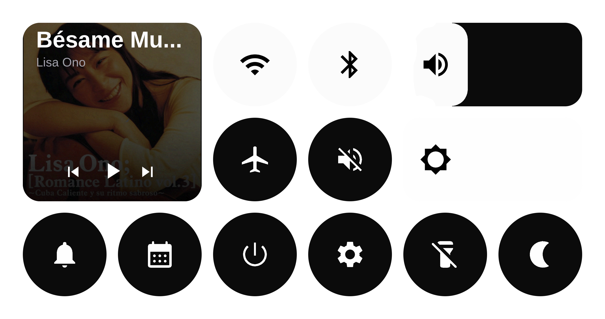

<div align="center">
  <h2>DropDeck</h2>
  
  <em>Just like you swipe-down in your Phone, but for your Linux desktop.</em>
</div>

## Features

- **Phone-style drag-down panel** for quick access to controls.
- **Quick toggles** for Wi-Fi, Bluetooth, Airplane mode, and DND.
- **Media controls** (play/pause, next/previous, metadata/art when available).
- **Notification popups + history** so alerts are visible but manageable.
- **Power menu** with lock, suspend, reboot, shutdown, and logout.
- **Theme system** with multiple bundled themes and runtime switching.

## Why Dropdeck?

I was never a fan of the _bar_ / _docks_ solutions on Linux. Since my screen is small, I want to be able use as much of it as possible.

So that’s what I did: an _invisible_ menu that I can pull down at any time _(just like my phone)_ to access things more quickly.

If you think Dropdeck would be useful to you, go ahead and try it — any feedback is welcome.

## Quick Start

```bash
git clone https://github.com/maria-rcks/dropdeck.git
cd dropdeck
qs -p .
```

## Debugging crashes

If `qs -d` crashes intermittently, collect a full bundle:

```bash
./scripts/collect-quickshell-crash.sh
```

This writes timestamped artifacts under `./debug-artifacts/` including:
- latest quickshell coredump summary/details
- latest quickshell runtime log directory (`/run/user/$UID/quickshell/by-id/...`)
- current-boot journal entries for quickshell
- minimal environment + git state snapshot

You can pass a custom output directory:

```bash
./scripts/collect-quickshell-crash.sh /tmp/dropdeck-debug
```

## Requirements

| Requirements | Used for |
| :----------- | :------- |
| `nmcli` | Wi-Fi state + network listing/connection |
| `rfkill` | Airplane mode toggle |
| `brightnessctl` | Brightness read/write |
| `wpctl` | Volume read/write + mute |
| `playerctl` | Media controls + metadata |
| `bluetoothctl` | Bluetooth device list/connect |
| `loginctl` | Lock/logout actions |
| `systemctl` | Suspend/reboot/poweroff |
| `wlsunset` or `gammastep` | Night light toggle |
